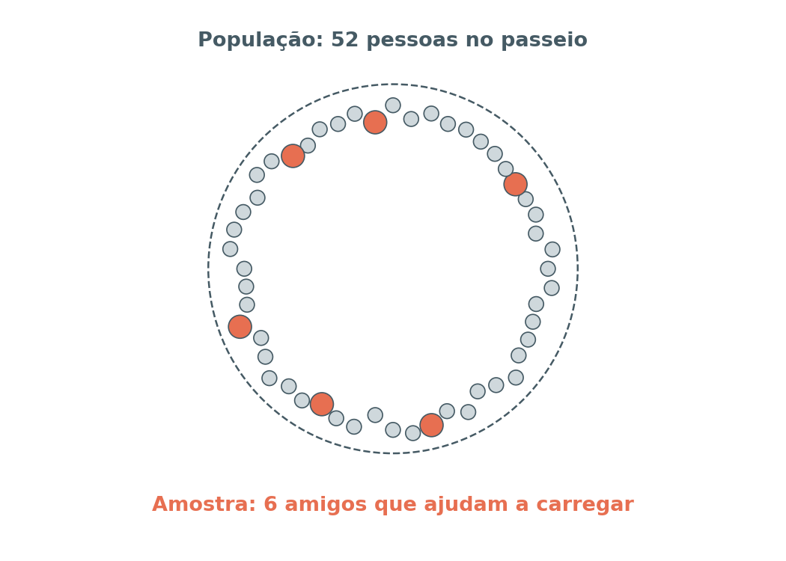
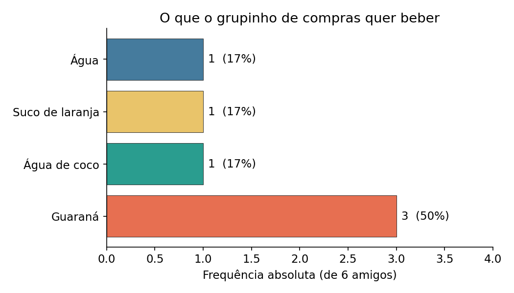
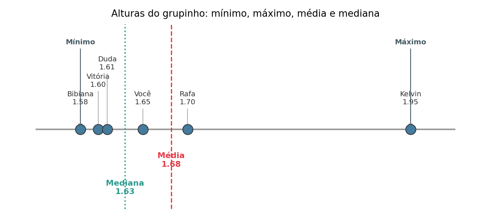
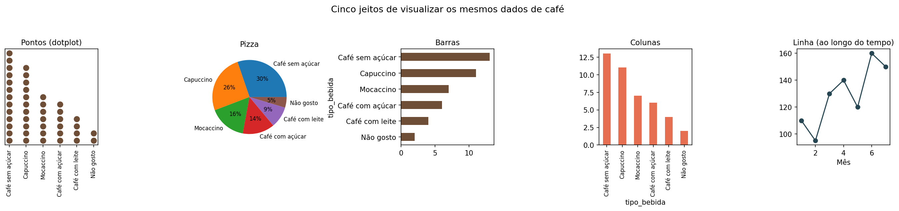
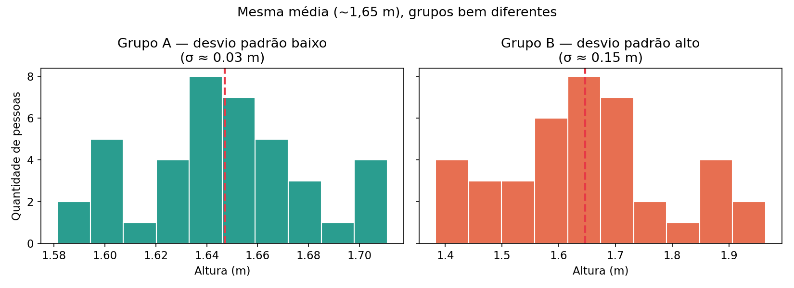
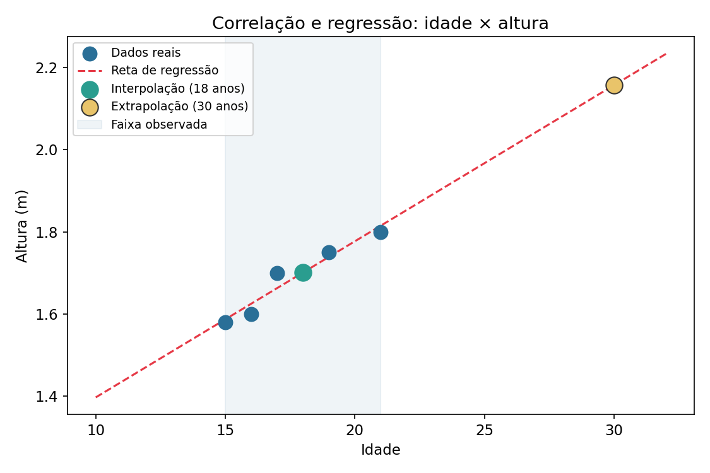
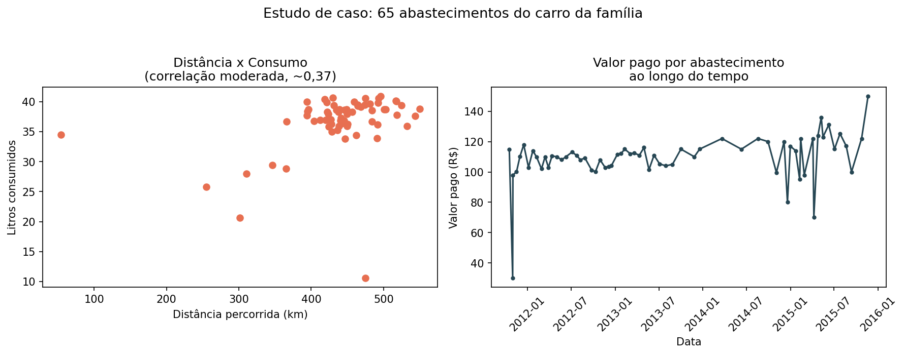

# Uma Tardezinha na Beira do Guaíba

### Estatística e Análise de Dados contadas como uma história

---

## Antes de começar

Esse material foi feito pra quem tá no segundo grau e nunca teve muita vontade de gostar de matemática — e é exatamente por isso que ele não vai começar com fórmula nenhuma. Vai começar com uma tarde de sol, um grupo de amigos e um problema bem real: **o que a gente compra pra beber quando não sabe o que todo mundo quer?**

Cada capítulo aqui tem uma versão em código, pronta pra rodar no Google Colab, no notebook `curso_estatistica_guaiba.ipynb`. A ideia é ler um pedaço da história aqui, depois ir no notebook, rodar o código e ver o resultado com os próprios olhos (e números).

---

## Capítulo 1 — O convite

É sábado de manhã e o grupo da escola combinou de ir até a orla do Guaíba. Sol bom, dia livre, muita gente animada — ao todo, **52 pessoas** vão aparecer ao longo da tarde, entre quem chega mais cedo e quem chega depois do almoço.

Alguém precisa ficar responsável por comprar as bebidas no quiosque. Esse alguém é você. E, pra ajudar a carregar as caixas, você tem **mais 5 amigos** — ou seja, contando com você, um grupinho de **6 pessoas**.

Antes de sair correndo pra comprar, surge a primeira pergunta que separa quem entende de estatística de quem só está "chutando":

> **Comprar bebida pra 52 pessoas baseado no gosto de quantas pessoas?**

Se você comprar só pensando no que **você** quer beber, a resposta é fácil, mas quase certamente errada: você não representa as outras 51 pessoas. Isso nos leva ao primeiro conceito importante:

- **População**: o conjunto completo que você quer entender. Aqui, as 52 pessoas do passeio.
- **Amostra**: uma parte da população, usada pra tentar representar o todo. Aqui, os 6 amigos que estão no grupinho das compras.

Repare que população **não precisa ser gente**: pode ser um ano inteiro de gastos, todos os cafés vendidos em um mês, todas as corridas de um app. O que importa é que é o "todo" que você quer conhecer, e a amostra é o pedaço que você consegue efetivamente observar.



E aqui mora o primeiro perigo: **uma amostra pequena e mal escolhida pode te enganar**. Se você perguntar só pra você mesmo (uma "amostra" de 1 pessoa), a chance de acertar o gosto de 52 pessoas é praticamente nula. Uma amostra de 6 já é bem melhor — mas ainda tem seus riscos, como veremos.

---

## Capítulo 2 — Organizando o que a gente já sabe

Antes de perguntar pra mais gente, vamos organizar a informação que já temos. Estatística começa, quase sempre, com uma **tabela**.

Uma tabela tem duas partes:

- **Série (ou coluna, ou variável)**: a categoria de informação que está sendo registrada. Exemplo: "Bebida escolhida".
- **Observação (ou linha)**: o conjunto de respostas de uma pessoa (ou um item) da amostra.

Digamos que você perguntou pros 5 amigos que vão te ajudar a carregar as caixas (e anotou a sua também):

| Pessoa | Bebida escolhida |
|---|---|
| Você | Guaraná |
| Bibiana | Água de coco |
| Rafa | Guaraná |
| Duda | Suco de laranja |
| Kelvin | Guaraná |
| Vitória | Água |

Isso já é uma tabela de pesquisa, com 6 observações. A partir dela, dá pra organizar de várias formas: **ordenar** por ordem alfabética, **agrupar** por bebida igual, separar em pequenos subconjuntos por tipo. Cada uma dessas formas ajuda a enxergar um padrão diferente nos dados.

---

## Capítulo 3 — Quantas vezes cada bebida apareceu? (Frequência)

Olhando pra tabela dos 6 amigos, dá pra contar quantas vezes cada bebida foi escolhida. Isso é a **frequência**, e ela aparece de três formas:

- **Frequência absoluta**: quantas vezes o valor apareceu, contando puro e simples.
- **Frequência relativa**: a frequência absoluta dividida pelo total de observações, normalmente em porcentagem. Ela responde "que fatia do grupo escolheu isso?".
- **Frequência acumulada**: a soma das frequências até aquele ponto, útil quando os itens têm alguma ordem ou hierarquia entre si.

Para o nosso grupinho de 6:

| Bebida | Frequência absoluta | Frequência relativa |
|---|---|---|
| Guaraná | 3 | 50% |
| Água de coco | 1 | 17% |
| Suco de laranja | 1 | 17% |
| Água | 1 | 17% |

O valor que mais aparece — nesse caso, Guaraná, com 3 ocorrências — é chamado de **moda**. É o "gosto do grupo", pelo menos segundo essa amostra.



Se você multiplicar a frequência relativa pelas 52 pessoas do passeio, teria uma estimativa de quanto comprar de cada bebida: cerca de 26 guaranás, 9 águas de coco, 9 sucos de laranja e 9 águas. Somando isso dá **53**, uma pessoa a mais que as 52 do passeio — não é erro de conta, é só o efeito de arredondar cada categoria separadamente (26 + 9 + 9 + 9 = 53). Isso é normal em estatística: ao arredondar partes de um todo uma por uma, a soma pode "escapar" um pouquinho do total. Na prática, não é motivo pra preocupação — só ajuste a última categoria pra fechar exatamente 52, se quiser ser certinho.

Mas será que 6 pessoas são suficientes pra confiar nesse número?

---

## Capítulo 4 — Chega mais um, e tudo muda

Bem na hora que você ia sair pro quiosque, chega o Renan, que também topa ajudar a carregar. Ele quer **suco de laranja**. Agora o grupinho é de **7 pessoas**, e a tabela de frequência muda:

| Bebida | Frequência absoluta (n=7) | Frequência relativa (n=7) |
|---|---|---|
| Guaraná | 3 | 43% |
| Suco de laranja | 2 | 29% |
| Água de coco | 1 | 14% |
| Água | 1 | 14% |

Guaraná continua sendo a moda, mas a fatia de suco de laranja quase dobrou (de 17% para 29%), só porque **uma pessoa a mais** entrou na conta. Isso é uma lição importante:

> **Quanto menor a amostra, mais uma única resposta pesa no resultado final — e mais fácil é a estimativa "balançar" e ficar diferente da realidade.**

Isso não quer dizer que toda amostra pequena está errada. Quer dizer que precisamos ser cuidadosos: quanto mais gente perguntarmos (dentro do razoável), mais estável e confiável fica a nossa estimativa da população inteira. No notebook, vamos simular isso de verdade: pegar amostras de tamanhos diferentes de uma "população" de referência e ver a estimativa dançar — e se acalmar — conforme a amostra cresce.

---

## Capítulo 5 — O quiosque não tem tudo

Vocês chegam no quiosque animados, prontos pra comprar... e descobrem que ele só vende **café** (expresso, com açúcar, sem açúcar, com leite, cappuccino, mocaccino). Nada de guaraná, suco ou água de coco. Mudança de plano!

Isso é muito comum em qualquer pesquisa real: **a coleta de dados é limitada pelas opções disponíveis**. Vocês decidem então perguntar de novo, mas agora perguntando o tipo de café que cada um tomaria — e alguém pode responder **"não gosto"**, o que também é uma resposta válida (e importante de registrar, porque significa "não compre nada pra essa pessoa").

Esse é exatamente o cenário do arquivo `cafe.csv`, que representa uma pesquisa authentic com 43 pessoas — pense nele como se fosse a "população de referência" desse experimento (um grupo de estudantes de verdade que respondeu essa pergunta). No notebook, vamos usar esse arquivo pra:

1. Calcular a frequência absoluta e relativa de cada tipo de café entre as 43 respostas.
2. Tirar amostras pequenas (5, 10, 15 pessoas) desse arquivo e comparar a estimativa da amostra com o valor "real" da população inteira.
3. Ver, na prática, o quanto uma amostra de 5 pessoas pode enganar — e como isso se relaciona com decidir quantos cafés comprar pra um grupo de 52.

---

## Capítulo 6 — Quem é mais alto, quem é mais baixo, e qual é o "meio-termo"?

Enquanto a fila do quiosque anda, alguém comenta que ia ser engraçado descobrir quem, no grupo de amigos, é o mais alto e o mais baixo. Isso nos leva às **medidas de posição**:

- **Mínimo**: o menor valor da série.
- **Máximo**: o maior valor da série.
- **Média**: soma de todos os valores dividida pela quantidade de valores. Indica uma posição "central" dos dados.
- **Mediana**: o valor que fica exatamente no meio quando os dados estão ordenados. Se o número de elementos for par, é a média dos dois valores centrais.

A diferença entre média e mediana importa bastante quando existe algum valor muito fora do padrão. Imagine as alturas (em metros) do grupinho:

```
1,58 — 1,60 — 1,61 — 1,65 — 1,70 — 1,95
```

A média sobe bastante por causa do 1,95 (alguém bem mais alto que o resto), enquanto a mediana (média entre 1,61 e 1,65 = **1,63**) continua representando melhor "a altura típica" do grupo. Por isso, quando os dados têm valores muito extremos, a mediana costuma contar uma história mais justa que a média sozinha.



---

## Capítulo 7 — Vendo os dados em vez de só ler números

Uma tabela de números é útil, mas o olho humano entende **padrões visuais** muito mais rápido do que colunas de números. Por isso, usamos gráficos:

- **Gráfico de pontos (dotplot)**: mostra a frequência de cada valor como uma pilha de pontos. Bom pra ver rapidinho qual valor é mais comum.
- **Gráfico de pizza (ou de setor)**: mostra a frequência relativa como fatias de um todo — ótimo pra "isso é X% do grupo".
- **Gráfico de barras/colunas**: compara valores entre categorias diferentes, com a altura (ou comprimento) proporcional à frequência.
- **Gráfico de linha**: usado quando os dados têm uma ordem natural, geralmente o tempo no eixo horizontal (eixo x) e o valor que muda no eixo vertical (eixo y).
- **Histograma**: parecido com o de colunas, mas agrupa valores numéricos em faixas (por exemplo, "de 0 a 20 reais", "de 20 a 40 reais"), útil quando os valores são muito variados e contínuos.



No notebook vamos gerar todos esses gráficos a partir dos dados do café e, mais adiante, dos dados de combustível.

---

## Capítulo 8 — O quanto os dados "variam" (Desvio Padrão)

Voltando pras alturas do grupo: dois grupos podem ter exatamente a mesma média de altura, só que um deles é bem "parecido" (todo mundo perto da média) e o outro tem gente bem baixinha e bem alta ao mesmo tempo. A média sozinha não conta essa diferença — pra isso existe o **desvio padrão**.

O desvio padrão mede o quanto os valores costumam se afastar da média, em média. Ele é calculado assim:

1. Calcule a **variância**: a média do quadrado da diferença entre cada valor e a média do grupo.
2. O **desvio padrão** é a raiz quadrada da variância.

Quanto **maior** o desvio padrão, mais "espalhados" estão os dados. Quanto **menor**, mais parecidos entre si eles são. Esse conceito é útil pra muita coisa prática: por exemplo, empresas usam o desvio padrão de gastos em cartão de crédito pra identificar uma compra "fora do padrão" — o que pode ser sinal de fraude.



---

## Capítulo 9 — Existe relação entre duas coisas? (Correlação)

Alguém do grupo brinca: "será que tem a ver a idade da pessoa com o tipo de café que ela pede?" Isso é uma pergunta sobre **correlação**: quando duas variáveis parecem "andar juntas".

- Correlação **próxima de 1**: quando uma variável aumenta, a outra também tende a aumentar (relação positiva).
- Correlação **próxima de -1**: quando uma aumenta, a outra tende a diminuir (relação negativa).
- Correlação **próxima de 0**: não existe relação linear perceptível entre as duas.

Importante: **correlação não é a mesma coisa que causa e efeito**. Existem correlações completamente sem sentido lógico, chamadas de **correlações espúrias** — por exemplo, alguém já demonstrou estatisticamente uma "correlação" entre a taxa de divórcio em um estado americano e o consumo de margarina por lá. Os números batem, mas não existe nenhuma relação real de causa entre as duas coisas. (Você pode se divertir vendo mais exemplos assim em [tylervigen.com/spurious-correlations](http://www.tylervigen.com/spurious-correlations).)

---

## Capítulo 10 — Prevendo valores que a gente não tem (Regressão, Interpolação e Extrapolação)

Se duas variáveis têm uma correlação forte, dá pra construir uma **regressão linear**: uma equação que descreve essa relação e permite **estimar** um valor que você não tem diretamente.

- **Interpolação**: estimar um valor **dentro** da faixa que você já observou. Exemplo: se você sabe a altura média de meninas aos 10 e aos 11 anos, dá pra estimar a altura de uma menina de 10 anos e 2 meses.
- **Extrapolação**: estimar um valor **fora** da faixa observada. É mais arriscado, porque assume que o padrão vai continuar do mesmo jeito além do que foi medido — o que nem sempre é verdade. (Se você extrapolar demais a curva de crescimento de uma criança, pode "prever" um adulto de mais de 2 metros, o que geralmente não faz sentido.)



Vamos aplicar isso de um jeito bem concreto no Capítulo 11: prever o custo de combustível de uma viagem futura com base no histórico de viagens anteriores.

---

## Capítulo 11 — Estudo de caso real: quanto custa ir até o Guaíba de carro?

Depois do café, a conversa vai pro carro que trouxe o grupo até a orla. Alguém teve a ideia de guardar, viagem após viagem, os dados de abastecimento do carro da família: data, distância percorrida, preço do álcool, preço da gasolina, valor pago e litros abastecidos. Esse histórico é exatamente o arquivo `combustivel.csv`, com **65 abastecimentos** ao longo de alguns anos.

Vamos aplicar a metodologia completa de análise de dados, que tem 6 passos:

1. **Definir perguntas** — o que queremos responder? Por exemplo: "quanto vamos gastar de combustível pra ir e voltar do Guaíba num passeio de X km?"
2. **Definir o que medir** — distância percorrida, litros, valor pago, rendimento (km por litro).
3. **Definir como medir** — usar o histórico de abastecimentos já registrado no carro.
4. **Coletar os dados** — já temos: é o `combustivel.csv`.
5. **Analisar os dados** — calcular médias, ver a variação mês a mês, checar correlações (será que quanto mais se roda, mais se gasta? é óbvio, mas vamos confirmar com números), montar uma regressão simples de custo por distância.
6. **Interpretar os resultados** — responder a pergunta original, apontando limitações (por exemplo: preço do combustível muda com o tempo, então uma regressão feita com dados de 2011 pode não valer mais hoje).

No notebook, faremos justamente isso: uma análise **descritiva** (médias, mínimo, máximo), uma análise **exploratória** (gráficos e correlação entre litros e distância), e vamos terminar estimando, por interpolação/extrapolação, quanto custaria uma viagem de uma distância específica — o mesmo raciocínio que qualquer família usa (mesmo sem saber o nome bonito) pra planejar uma viagem mais longa.

Um detalhe interessante que vamos encontrar: o rendimento mínimo e máximo calculado a partir dos dados brutos fica bem distante do que um carro real faz (por exemplo, valores abaixo de 2 km/l ou acima de 40 km/l). Isso é sinal de **dado "sujo"** — provavelmente abastecimentos parciais, onde o tanque não foi completado — e mostra, na prática, por que o passo 5 da metodologia (analisar) às vezes obriga a gente a voltar pro passo 4 (coletar/organizar) antes de confiar nas conclusões.



---

## Capítulo 12 — Análise qualitativa x quantitativa (recapitulando)

Ao longo da tarde, usamos dois tipos de análise:

- **Análise quantitativa**: baseada em números e cálculos — frequência, média, desvio padrão, correlação. É o que fizemos com as bebidas, alturas e o combustível.
- **Análise qualitativa**: baseada em opiniões, textos e observações — por exemplo, se alguém perguntasse "o que vocês acharam do passeio?" e as respostas fossem frases livres, precisaríamos categorizar palavras-chave e temas em comum, em vez de simplesmente contar números.

Os dois tipos se completam: números mostram "o quê" e "quanto"; opiniões e observações ajudam a entender "por quê".

---

## Capítulo 13 — Seu desafio: aplique isso na sua vida

Agora é a sua vez de usar essas ferramentas em algo que você realmente vive no dia a dia. Escolha um tema simples, por exemplo:

- Quanto você gasta (ou sua família gasta) por mês em transporte, lanche, internet, dados do celular.
- Quanto tempo você passa por dia em determinado aplicativo, ou assistindo TV, ou no ônibus.
- Quantas vezes por semana você consome um item específico (chimarrão, café, um lanche, um produto qualquer).

Depois:

1. Anote os dados por pelo menos duas ou três semanas.
2. Organize numa tabela.
3. Calcule frequência, média, mínimo, máximo e, se fizer sentido, desvio padrão.
4. Construa pelo menos dois gráficos diferentes.
5. Escreva 3 a 5 frases interpretando o que os números e gráficos estão te dizendo — e se existe alguma coisa que te surpreendeu.

O notebook tem uma seção final com um "esqueleto" de código pronto pra você só trocar pelos seus próprios dados.

---

## Glossário rápido

| Termo | Significado |
|---|---|
| População | Conjunto completo de elementos que se quer estudar |
| Amostra | Parte da população usada para representar o todo |
| Variável / Série | Categoria de informação (coluna de uma tabela) |
| Observação | Linha de uma tabela, com os valores de um elemento |
| Frequência absoluta | Número de vezes que um valor aparece |
| Frequência relativa | Frequência absoluta dividida pelo total, em % |
| Frequência acumulada | Soma progressiva das frequências |
| Moda | Valor de maior frequência |
| Média | Soma dos valores dividida pela quantidade |
| Mediana | Valor central após ordenar os dados |
| Mínimo / Máximo | Menor / maior valor da série |
| Desvio padrão | Medida de quanto os valores se afastam da média |
| Correlação | Relação estatística entre duas variáveis |
| Regressão linear | Equação que descreve a relação entre variáveis |
| Interpolação | Estimativa de valor dentro do intervalo observado |
| Extrapolação | Estimativa de valor fora do intervalo observado |
| Análise quantitativa | Baseada em números e cálculos |
| Análise qualitativa | Baseada em opiniões e observações |

---

*Continue no notebook `curso_estatistica_guaiba.ipynb` para colocar tudo isso em prática, com dados reais e gráficos gerados por você.*
